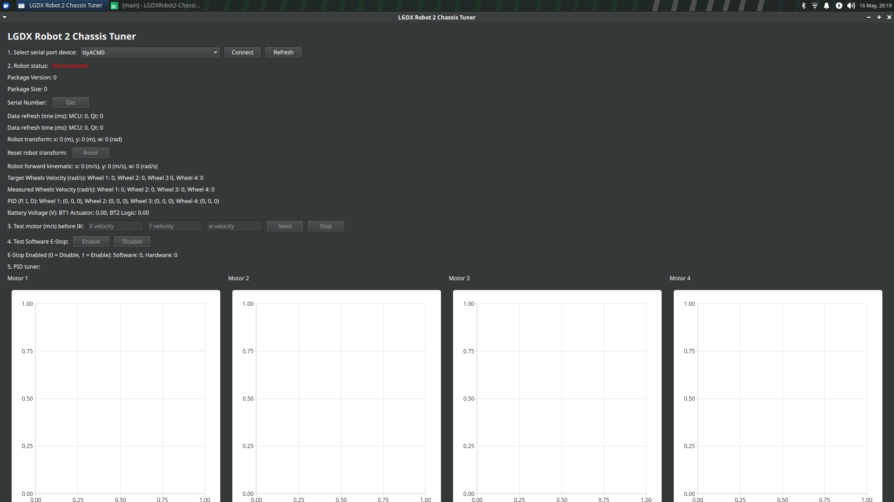

LGDXRobot2 ChassisTuner is a GUI tool written in Qt, designed for testing and fine-tuning LGDXRobot2 hardware. It allows you to validate your setup and optimise performance. The repository is available in the [lgdxrobot2-chassistuner](https://gitlab.com/yukaitung/lgdxrobot2-chassistuner) repository.

As the tool depends on Qt Graphs, it is the only component released under the GPLv3 licence.

