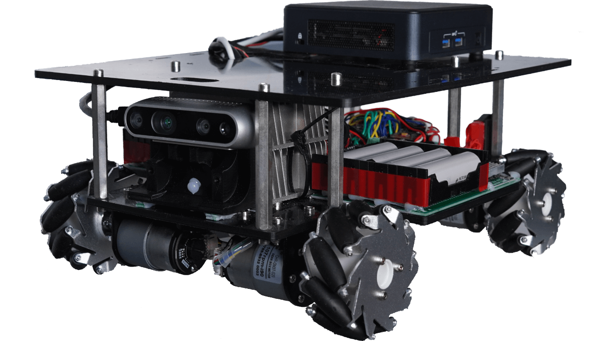

LGDXRobot2 MCU is an STM32-based controller board designed specifically for the LGDXRobot2 platform. It supports a four-wheeled Mecanum chassis configuration with a straightforward, minimalistic design. While both the hardware design and source code are provided, the firmware must be compiled and uploaded manually to the device.

